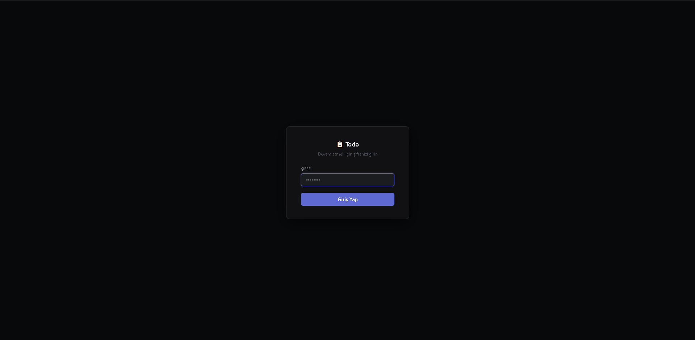
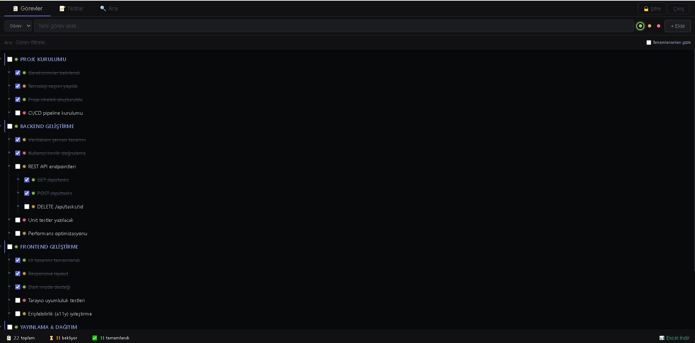
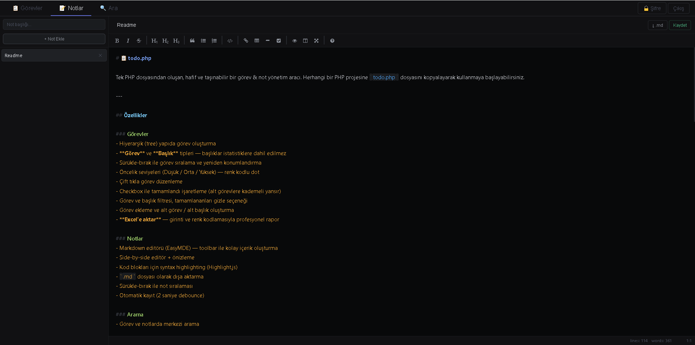
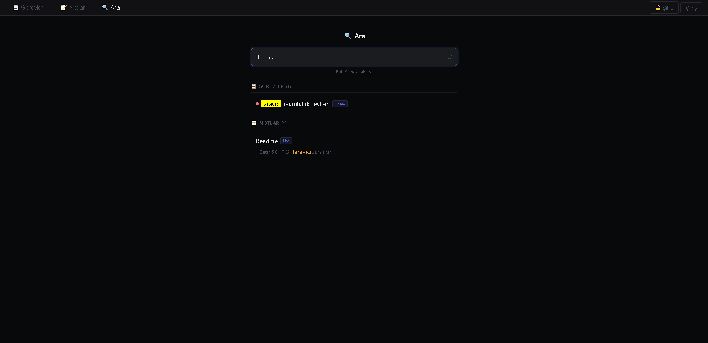

# 📋 todo.php

Tek PHP dosyasından oluşan, hafif ve taşınabilir bir görev & not yönetim aracı. Herhangi bir PHP projesine `todo.php` dosyasını kopyalayarak kullanmaya başlayabilirsiniz.

---

## Özellikler

### Görevler
- Hiyerarşik (tree) yapıda görev oluşturma
- **Görev** ve **Başlık** tipleri — başlıklar istatistiklere dahil edilmez
- Sürükle-bırak ile görev sıralama ve yeniden konumlandırma
- Öncelik seviyeleri (Düşük / Orta / Yüksek) — renk kodlu dot
- Çift tıkla görev düzenleme
- Checkbox ile tamamlandı işaretleme (alt görevlere kademeli yansır)
- Görev ve başlık filtresi, tamamlananları gizle seçeneği
- Görev ekleme ve alt görev / alt başlık oluşturma
- **Excel'e aktar** — girinti ve renk kodlamasıyla profesyonel rapor

### Notlar
- Markdown editörü (EasyMDE) — toolbar ile kolay içerik oluşturma
- Side-by-side editör + önizleme
- Kod blokları için syntax highlighting (Highlight.js)
- `.md` dosyası olarak dışa aktarma
- Sürükle-bırak ile not sıralaması
- Otomatik kayıt (2 saniye debounce)

### Arama
- Görev ve notlarda merkezi arama
- Notlarda satır bazlı snippet sonuçları
- Sonuca tıklayınca ilgili sekme ve kayda otomatik geçiş

### Güvenlik
- Şifre korumalı giriş (bcrypt hash)
- PHP session tabanlı kimlik doğrulama
- Şifre değiştirme modalı

---

## Kurulum

```bash
# 1. todo.php dosyasını projenizin public klasörüne kopyalayın
cp todo.php /your-project/public/todo.php

# 2. PHP ve SQLite yüklü olduğundan emin olun
php --version   # PHP 8.0+
php -m | grep sqlite3

# 3. Tarayıcıdan açın
http://localhost/todo.php
```

> İlk açılışta `todo.db` otomatik oluşturulur. Varsayılan şifre: **`admin123`**

---

## Gereksinimler

| Gereksinim | Versiyon |
|-----------|---------|
| PHP | 8.0+ |
| SQLite | PDO ile birlikte gelir |
| Web sunucusu | Apache, Nginx veya `php -S` |

Harici bağımlılık yoktur. Tüm kütüphaneler CDN üzerinden yüklenir.

---

## Taşınabilirlik

Sadece `todo.php` dosyasını kopyalamanız yeterlidir. Yeni bir projeye taşıdığınızda:

- Eski veriler **gelmez** — yeni bir `todo.db` oluşturulur
- Şifre sıfırlanır → varsayılan: `admin123`
- Hemen kullanmaya başlayabilirsiniz

---

## Kullanılan Teknolojiler

| Kütüphane | Amaç |
|-----------|------|
| [sortable-tree](https://github.com/marcantondahmen/sortable-tree) | Hiyerarşik görev ağacı |
| [SortableJS](https://sortablejs.com) | Not listesi sürükle-bırak |
| [EasyMDE](https://github.com/Ionaru/easy-markdown-editor) | Markdown editörü |
| [Highlight.js](https://highlightjs.org) | Kod bloğu renklendirme |
| [xlsx-js-style](https://github.com/gitbrent/xlsx-js-style) | Excel dışa aktarma |
| [Font Awesome](https://fontawesome.com) | Editör toolbar ikonları |

---

## Varsayılan Şifre

```
admin123
```

İlk girişten sonra **🔒 Şifre** butonundan değiştirmeniz önerilir.

---

## Ekran Görüntüleri

**Şifre ile giriş**


**Görevler — Tree yapısı, öncelik ve filtre**


**Notlar — Markdown editör ve side-by-side önizleme**


**Arama — Görev & not içinde merkezi arama**


---

## Lisans

MIT — özgürce kullanabilir, değiştirebilir, dağıtabilirsiniz.
